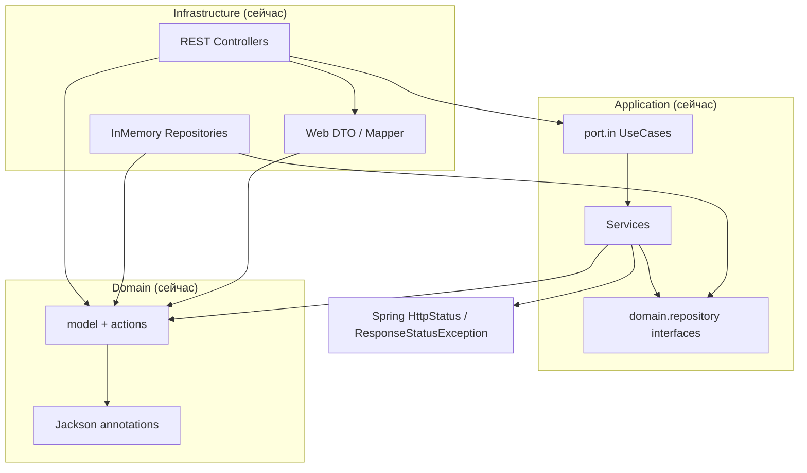
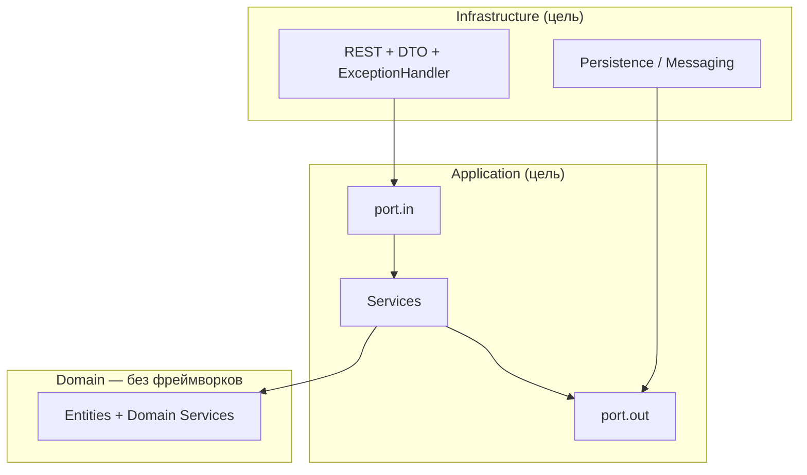

# Аудит: соответствие серверного кода гексагональной архитектуре

> **Связанный документ:** [План рефакторинга](refactoring-plan.md) — поэтапное приведение кода к целевой архитектуре.

**Дата аудита:** май 2026  
**Область:** пакет `ru.lr.fantasy.*`, модуль `fantasy` (корневой Spring Boot)  
**Ориентир:** правило Cursor `hexagonal-architecture-java.mdc` (Ports & Adapters)

---

## 1. Резюме

| Параметр | Значение |
|----------|----------|
| **Вердикт** | **Частичное соответствие (partial)** |
| **Объём** | ~54 Java-файла в `src/main/java/ru/lr/fantasy/` |
| **Сборка** | Один Gradle-модуль; `fantasy.server` в `settings.gradle`, но **не** в runtime REST-приложения |

Проект **осознанно** разложен на `domain` / `application` / `infrastructure`: inbound-порты, application-сервисы, persistence-адаптеры, контроллеры без прямого доступа к репозиториям. Игровая логика в значительной степени в домене (`IGameAction`, `Turn.doTurn()`, `World.battle()` и т.д.).

Систематические отступления от строгой гексагонали: зависимости домена от Jackson и REST-диагностики, outbound-контракты в `domain.repository`, Spring Web в application-слое, маппинг DTO→домен в контроллере, отсутствие Gradle-границ модулей.

---

## 2. Где живёт серверный код

| Слой (задумка) | Пакет / путь | Содержимое |
|----------------|--------------|------------|
| Точка входа | `ru.lr.fantasy.FantasyApplication` | Spring Boot |
| **Domain** | `domain.model`, `.model.action`, `.model.building`, `.model.visitors`, `.repository` | `World`, `Land`, `Turn`, `Player`, `IGameAction`, здания, `WorldFactory` |
| **Application** | `application.port.in`, `.service`, `.port.out` (заглушка) | Use cases + сервисы |
| **Infrastructure** | `infrastructure.web`, `.persistence`, `.config`, `.messaging` (заглушка) | REST, in-memory repos, конфиг |

**Легаси:** подмодуль `fantasy.server` (`ru.lr.entity.*`) — дубликат модели, не подключён к корневому приложению.

---

## 3. Карта слоёв

### 3.1. Текущий поток зависимостей

```
                    [ HTTP / Spring MVC ]
                              |
              infrastructure.web.controller.*
              (WorldController, LandController, TurnController, PlayerController)
                              |
                    application.port.in.*UseCase
                              |
              application.service.*Service
                              |
         domain.repository.*  +  domain.model.*
                              |
              infrastructure.persistence.InMemory*Repository
```

### 3.2. Соответствие элементам гексагона

| Гексагональный элемент | Фактически в проекте | Оценка |
|------------------------|----------------------|--------|
| Domain (ядро) | `domain.model`, `domain.model.action` | Есть, с поведением |
| Inbound port | `application.port.in.*UseCase` | Есть |
| Inbound adapter | `infrastructure.web.controller` | Есть |
| Outbound port | `domain.repository.WorldRepository`, `PlayerRepository` | Есть как интерфейсы, **пакет неверный** |
| Outbound adapter | `infrastructure.persistence.InMemory*` | Есть |
| Application services | `application.service.*` | Есть |
| `application.port.out` | Только `package-info.java` (ссылается на `domain.repository`) | Пусто |

### 3.3. Диаграмма: текущее vs целевое





---

## 4. Что сделано хорошо

### 4.1. Направление зависимостей REST → use case → domain

Контроллеры зависят от **inbound-портов**, а не от репозиториев:

- `WorldController` → `WorldUseCase`
- `LandController` → `LandUseCase`
- `TurnController` → `TurnUseCase`
- `PlayerController` → `PlayerUseCase`

### 4.2. Inbound ports как явные контракты

`WorldUseCase`, `LandUseCase`, `TurnUseCase`, `PlayerUseCase` в `application.port.in` — сервисы их реализуют (`WorldService`, `LandService`, …).

### 4.3. Бизнес-логика в домене, application — оркестрация

`LandService` загружает мир, проверяет ход, делегирует в домен через `turn.acceptAction(...)`, сохраняет. Доменные действия (`BuildBuildingAction`, `WarriorsMoveInAction`, `CollectCastleIncomeAction`) и агрегатная логика (`World.battle`, `Land.addWarriors`, `Turn.doTurn`) — в `domain.model`.

### 4.4. Outbound adapters реализуют порты

`InMemoryWorldRepository` / `InMemoryPlayerRepository` реализуют интерфейсы и лежат в `infrastructure.persistence`.

### 4.5. Отдельные request/DTO и diagnostic mapping (частично)

- Request DTO: `infrastructure.web.dto.request.*`
- Диагностический снимок мира: `WorldDiagnosticDto` + `WorldDiagnosticMapper` — отделение «тяжёлого» JSON от обычного `World` в эндпоинте `WorldController.getWorldDiagnostic`.

### 4.6. Заготовки под расширение

`application.port.out`, `domain.service`, `infrastructure.messaging` — package-info с намерением (пока без реализаций).

### 4.7. Чего нет (и это плюс)

- Domain **не** импортирует Spring, JPA, JDBC.
- Контроллеры **не** инжектят `WorldRepository` / `PlayerRepository` напрямую.
- Явных циклических зависимостей между пакетами не обнаружено.

---

## 5. Нарушения и риски

### 5.1. Высокая серьёзность

| Проблема | Где | Почему это нарушение |
|----------|-----|----------------------|
| **Jackson в domain** | `Turn.java`, `Land.java`, `World.java`, `Buildings.java` — `com.fasterxml.jackson.annotation.*` | Домен зависит от инфраструктуры сериализации REST; ядро нельзя переиспользовать без Jackson |
| **REST-специфика в domain** | `Turn.describePendingActionsForDiagnostic()`, `@JsonProperty` / комментарии «для JSON» в `Land`, `Buildings`, `World.getNeighbors()` | Presentation concern внутри домена |

**Пример** (`Turn.java`):

```java
/**
 * Диагностика REST: типы отложенных действий в порядке очереди.
 */
public List<String> describePendingActionsForDiagnostic() {
    return actionOfTurn.stream().map(a -> a.getClass().getName()).toList();
}
```

### 5.2. Средняя серьёзность

| Проблема | Где | Детали |
|----------|-----|--------|
| **Outbound ports в `domain.repository`** | `WorldRepository.java`, `PlayerRepository.java` | В strict hex driven ports объявляет **application** (`application.port.out`); domain о persistence не знает |
| **Spring Web в application** | `LandService`, `WorldService`, `PlayerService` — `ResponseStatusException`, `HttpStatus` | Application зависит от HTTP-фреймворка; ошибки должны маппиться в adapter (`@ControllerAdvice`) |
| **Маппинг и создание доменных объектов в контроллере** | `LandController.createBuilding()`, сборка `Warrior[]` в `moveWarriors` | Логика API → `Building` / `WarriorType` — inbound adapter, но часть в контроллере |
| **API отдаёт domain entities напрямую** | Большинство эндпоинтов возвращают `World`, `Land`, `Turn`, `Player` | Контракт API связан с моделью домена; вынуждает Jackson в domain |
| **Правила хода в application** | `LandService.assertLandOwnerIsCurrentPlayer`, `listMoveSourceLandsForCurrentTurn` | Часть инвариантов размазана между application и domain |
| **Нет модульных границ Gradle** | Один `java` source set | Нарушения не ловятся компилятором |

### 5.3. Низкая серьёзность

| Проблема | Где |
|----------|-----|
| `java.awt.Dimension` в `World`, `WorldFactory`, `WorldDiagnosticMapper` | Странная зависимость server domain от AWT |
| `@Service` / `@Component` без интерфейсной регистрации в config | Прагматичный Spring, не pure hex |
| Смешанные ошибки: `RuntimeException` vs `ResponseStatusException` | `LandService.getWorld` vs `WorldService.getWorld`; нет `@ControllerAdvice` |
| `Player` — по сути anemic (только поля) | Остальной домен богаче |
| README устарел (`ru.lr.domain`, `port/input`, `infrastructure.adapter`) | Риск для команды |
| `fantasy.server` / `ru.lr.entity` — дубликат модели | Путаница, не в runtime |
| Пустые `domain.service`, `infrastructure.messaging` | «Дыры» в слоях, не нарушение |

---

## 6. Anemic vs rich domain

**Смешанная модель:**

- **Rich:** `World` (бой, доход замков, перемещения), `Land` (войска, здания), `Turn` (очередь действий, смена игрока), паттерн `IGameAction` + visitor для зданий.
- **Anemic:** `Player` — в основном геттеры/сеттеры; создание в `PlayerService.createPlayer`.

Не критично для hex, но важное поведение лучше держать в агрегатах.

---

## 7. Таблица критериев соответствия

| Критерий | Статус |
|----------|--------|
| Domain без инфраструктурных фреймворков | **Частично** (нет Spring/JPA; есть Jackson, AWT, REST-хуки) |
| Inbound ports | **Да** (`application.port.in`) |
| Inbound adapters | **Да** (controllers), маппинг не везде вынесен |
| Outbound ports | **Да**, но в `domain.repository` |
| Outbound adapters | **Да** (`infrastructure.persistence`) |
| Направление: adapters → application → domain | **В целом да** |
| Бизнес-логика не в контроллерах | **В основном да**, исключение — `LandController` |
| Нет прямого repo из controllers | **Да** |
| Модульная изоляция | **Нет** (один модуль) |

---

## 8. Рекомендации (кратко)

Детальный поэтапный план — в [refactoring-plan.md](refactoring-plan.md).

### Быстрые победы

1. Убрать Jackson из domain — аннотации в `infrastructure.web.dto` или Jackson mixin в adapter.
2. Перенести `describePendingActionsForDiagnostic` и JSON-комментарии в `WorldDiagnosticMapper` / DTO.
3. Вынести `LandController.createBuilding` и маппинг warrior в mapper или command use case.
4. Единый стиль ошибок — domain/application exceptions + `@ControllerAdvice`.
5. Заменить `java.awt.Dimension` на VO `GridSize(int width, int height)` в domain.

### Средние refactor

6. Переместить `WorldRepository` / `PlayerRepository` в `application.port.out`.
7. Response DTO для всех публичных API вместо прямой отдачи `World`/`Land`.
8. Убрать `ResponseStatusException` из application.

### Крупные шаги

9. Multi-module Gradle + ArchUnit — enforce dependency rule.
10. Удалить или изолировать `fantasy.server`; синхронизировать README.
11. При появлении БД/шины — только `infrastructure.*`, реализующие `application.port.out`.

---

## 9. Итог для команды

Архитектурный **каркас гексагона заложен и используется** (use cases, сервисы, in-memory adapters, доменные actions). Для **«в основном compliant»** нужно убрать coupling domain↔Jackson/API, перенести repository ports в application layer и довести inbound adapter до полноценных API-DTO.

**Текущая оценка:** частичное соответствие с понятным путём улучшений без полной переписки.
