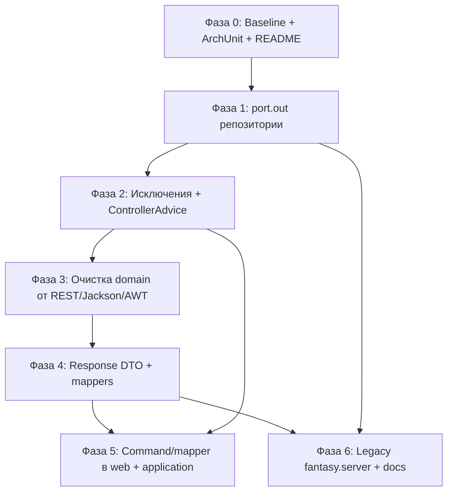
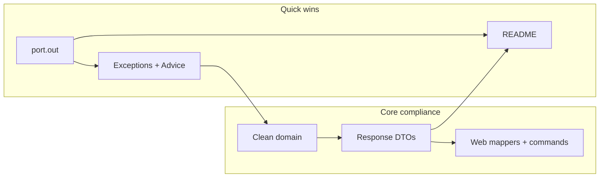

# План рефакторинга к гексагональной архитектуре

> **Связанный документ:** [Аудит архитектуры](hexagonal-audit.md) — текущее состояние, нарушения и обоснование плана.

**Дата:** май 2026  
**Область:** `ru.lr.fantasy.*`  
**Ориентир:** правило Cursor `hexagonal-architecture-java.mdc`  
**Статус:** план; **реализация кода не входит** в этот документ.

---

## 1. Текущее состояние (кратко)

**Уже близко к цели:** разделение на `domain` / `application` / `infrastructure`; inbound-порты `application.port.in.*`; контроллеры в основном вызывают use case; request-DTO в `infrastructure.web.dto.request`; diagnostic endpoint с `WorldDiagnosticDto` / `WorldDiagnosticMapper`.

**Подтверждённые нарушения:**

| Находка | Статус |
|--------|--------|
| Jackson в domain (`Turn`, `Land`, `World`, `Buildings`) | Подтверждено |
| REST-диагностика в domain (`describePendingActionsForDiagnostic`, `getNeighbors()` «для JSON») | Подтверждено |
| `WorldRepository` / `PlayerRepository` в `domain.repository` | Подтверждено; `application.port.out` пустой |
| `ResponseStatusException` / `HttpStatus` в application services | Подтверждено |
| `LandController` собирает `Building` / `Warrior`, парсит enum | Подтверждено |
| API отдаёт domain (`World`, `Land`, `Turn`, `Player`) | Подтверждено |
| `java.awt.Dimension` в `World`, `WorldFactory`, `WorldDiagnosticMapper` | Подтверждено |
| Смешанные ошибки: `RuntimeException` vs `ResponseStatusException` | Подтверждено (нет `@ControllerAdvice`) |
| `fantasy.server` (legacy `ru.lr.entity`) | В `settings.gradle`, не в runtime |
| README устарел | Пакеты не соответствуют коду |

**Частичный прогресс:** diagnostic DTO уже в infrastructure — задел есть; осталось убрать domain-методы только ради mapper/JSON.

---

## 2. Цели и критерии успеха

### 2.1. Цели

1. **Domain** — чистый Java: агрегаты, VO, доменные исключения, инварианты; без Spring, Jackson, HTTP, AWT, портов persistence.
2. **Application** — сценарии через `port.in` + `*Service`; outbound-контракты в `port.out`; ошибки прикладного/доменного уровня, не HTTP.
3. **Infrastructure** — REST (DTO + mapper + `ControllerAdvice`), persistence (адаптеры `port.out`); единственное место Jackson и HTTP-маппинга.

### 2.2. Критерии соответствия (проверяемые)

- В `domain/**` нет импортов: `com.fasterxml.*`, `org.springframework.*`, `java.awt.*`, `jakarta.*` (кроме тестов domain при необходимости).
- Нет пакета `domain.repository`; `WorldRepository`, `PlayerRepository` в `application.port.out`.
- Нет `ResponseStatusException` / `HttpStatus` в `application/**`.
- Контроллеры: только `port.in`, возвращают `infrastructure.web.dto.*`, не `domain.model.*`.
- Контроллеры не создают `Building` / `Warrior`; маппинг request → command/DTO → domain — в `infrastructure.web.mapper` или application command.
- Ошибки: domain/application бросают типизированные исключения → `@ControllerAdvice` → HTTP.
- **ArchUnit** (рекомендуется в фазе 0): правила `domain ← application ← infrastructure`.
- `./gradlew test` зелёный; ручная проверка API/frontend после фаз с DTO.

---

## 3. Quick wins vs крупные работы

### Quick wins (низкий риск, мало влияния на API)

| Задача | Затронутые файлы |
|--------|------------------|
| Перенос репозиториев в `application.port.out` | `domain/repository/*` → `application/port/out/` |
| Исправление `application/port/out/package-info.java` | Сейчас ссылается на `domain.repository` |
| Доменные/прикладные исключения + `@ControllerAdvice` | `application/service/*`, новый `infrastructure/web/advice/` |
| Унификация `RuntimeException` → типизированные исключения | `LandService`, `WorldService`, `TurnService` |
| Обновление README под `ru.lr.fantasy.*` | `README.md` |
| Вынос `PlayerController.CreatePlayerRequest` | → `infrastructure.web.dto.request` |

### Крупные рефакторинги

| Задача | Риск |
|--------|------|
| Удаление Jackson из domain + response-DTO | Высокий (контракт JSON) |
| Замена `Dimension` на domain VO (`GridSize`) | Средний |
| Команды на границе application вместо `Building` из controller | Средний |
| Удаление/архивация `fantasy.server` | Низкий |

---

## 4. Фазы 0–6

### Зависимости между фазами

### Порядок для команды (рекомендации)

| Стратегия | Порядок | Когда выбирать |
|-----------|---------|----------------|
| **Архитектурно чище** | 1 → 2 → 3+4 одним PR | Краткий freeze frontend допустим |
| **Непрерывный UI** | 1 → 2 → 4 (совместимые DTO) → 3 → 5 → 6 | Нужен работающий UI на каждом шаге |

---

### Фаза 0. Baseline, правила, документация

**Зависимости:** нет.

| Задача | Файлы / пакеты | Риск | Breaking API |
|--------|----------------|------|--------------|
| Зафиксировать целевую структуру пакетов | `README.md` | Низкий | Нет |
| Описать слои: `domain`, `application.port.in\|out`, `infrastructure` | `README.md` | Низкий | Нет |
| Добавить ArchUnit-тесты зависимостей | `src/test/java/.../architecture/` | Низкий | Нет |
| Инвентаризация контрактов API для frontend | `frontend/src/api/client.ts`, baseline JSON | Низкий | Нет |

**Проверка:** `./gradlew test`; ArchUnit может падать до фаз 1–4 (`@Disabled` с TODO или поэтапное ужесточение).

---

### Фаза 1. Outbound-порты (репозитории)

**Зависимости:** фаза 0 (желательно).

| Задача | Файлы | Риск | Breaking API |
|--------|-------|------|--------------|
| Переместить `WorldRepository`, `PlayerRepository` | `domain/repository/*` → `application/port/out/` | Низкий | Нет |
| Обновить импорты в services | `WorldService`, `LandService`, `TurnService`, `PlayerService` | Низкий | Нет |
| Адаптеры implements новые порты | `InMemoryWorldRepository`, `InMemoryPlayerRepository` | Низкий | Нет |
| Удалить `domain.repository`; обновить `port/out/package-info.java` | | Низкий | Нет |

**Проверка:** `./gradlew test`; smoke: create world, get world, player CRUD.

---

### Фаза 2. Единая модель ошибок

**Зависимости:** фаза 1.

| Задача | Файлы | Риск | Breaking API |
|--------|-------|------|--------------|
| Ввести исключения: `WorldNotFoundException`, `LandNotFoundException`, `PlayerNotFoundException`, `NotCurrentPlayerException`, `ConflictException` | `domain/exception/` или `application/exception/` | Средний | Нет*, если статусы совпадут |
| Заменить `ResponseStatusException` в services | `WorldService`, `LandService`, `PlayerService` | Средний | Нет* |
| Заменить `RuntimeException` | те же + `TurnService` | Средний | Нет* |
| `@RestControllerAdvice` + маппинг → 404/409/403 | `infrastructure/web/advice/GlobalExceptionHandler.java` | Средний | Возможны отличия body |
| Убрать `import org.springframework.http` из application | `application/service/*` | Низкий | Нет |

\*Сохранить те же HTTP-коды и по возможности те же сообщения.

**Проверка:** `./gradlew test`; ручные вызовы: несуществующий world/land/player; ход не того игрока; конфликты — 404/409/403.

---

### Фаза 3. Очистка domain от инфраструктурных concerns

**Зависимости:** фазы 1–2 (Jackson логичнее убирать вместе с фазой 4).

| Задача | Файлы | Риск | Breaking API |
|--------|-------|------|--------------|
| Удалить `@Json*`, `@JsonIdentityInfo` | `Turn.java`, `Land.java`, `World.java`, `Buildings.java` | Средний | **Да**, пока API сериализует domain — блокер до фазы 4 |
| Удалить `describePendingActionsForDiagnostic()` | `Turn.java`, `WorldDiagnosticMapper.java` | Низкий | Только `/diagnostic` |
| Удалить/перенести `World.getNeighbors()` | `World.java`, `WorldDiagnosticMapper.java` | Низкий | **Да** для `GET /api/worlds/{id}`, если клиент читал `neighbors` |
| Заменить `java.awt.Dimension` на `GridSize(int width, int height)` | `World.java`, `WorldFactory.java`, `WorldDiagnosticMapper.java` | Средний | **Да**: формат `size` в JSON |
| Оставить в domain только бизнес-методы | `Turn.java` (`getPendingActionsCount()` и т.д.) | Низкий | Зависит от DTO |

**Проверка:** domain unit-тесты без Jackson; после фазы 4 — контрактные тесты JSON.

---

### Фаза 4. Response DTO и mappers (граница REST)

**Зависимости:** фаза 3 (для снятия Jackson с domain).

| Задача | Файлы | Риск | Breaking API |
|--------|-------|------|--------------|
| DTO: `WorldResponse`, `LandResponse`, `TurnResponse`, `PlayerResponse`, … | `infrastructure/web/dto/response/*` | Высокий | **Потенциально да** |
| Mappers: domain → response | `infrastructure/web/mapper/*` | Высокий | Контролируемо |
| Контроллеры возвращают DTO | `*Controller` | Высокий | Да, если форма JSON изменится |
| Сохранить совместимость: `neighbors`, `hasCastle`, `pendingActionsCount`, … | mappers + DTO | Средний | Минимизировать ломку UI |
| `GET /diagnostic` — оставить отдельным | `WorldController` | Низкий | Нет для основных endpoints |

**Проверка:** `./gradlew test`; ручной прогон frontend; сравнение JSON с baseline из фазы 0.

---

### Фаза 5. Inbound-адаптеры: команды вместо сборки domain в controller

**Зависимости:** фазы 2, 4 (желательно).

| Задача | Файлы | Риск | Breaking API |
|--------|-------|------|--------------|
| `BuildingWebMapper` / `WarriorWebMapper` | `infrastructure/web/mapper/` | Средний | Нет |
| Application commands: `BuildBuildingCommand`, `MoveWarriorsCommand`, … | `application/command/` или расширение `port.in` | Средний | Нет |
| `LandUseCase.buildBuilding(..., Building)` → command или factory в service | `LandUseCase`, `LandService`, `LandController` | Средний | Нет |
| Парсинг enum / switch по зданию — только infrastructure | `LandController` | Низкий | Нет |
| Вынести `CreatePlayerRequest` из controller | `PlayerController` | Низкий | Нет |

**Проверка:** `./gradlew test`; POST build/recruit/move без регрессий.

---

### Фаза 6. Legacy и завершение

**Зависимости:** фазы 1, 4.

| Задача | Файлы | Риск | Breaking API |
|--------|-------|------|--------------|
| Решение по `fantasy.server`: deprecate / удалить из `settings.gradle` | `fantasy.server/**`, `settings.gradle` | Низкий | Нет (не в runtime) |
| README: актуальные пути, порты, diagnostic, frontend | `README.md` | Низкий | Нет |
| ArchUnit — все правила green | architecture tests | Низкий | Нет |
| Пустые `domain/service`, `infrastructure/messaging` | package-info или реализация при фичах | Низкий | Нет |

**Проверка:** `./gradlew build`; полный сценарий UI.

---

## 5. Диаграмма: quick wins и core compliance

---

## 6. Вне scope первой итерации

- Переход на JPA/БД (остаётся in-memory через `port.out`).
- Рефакторинг доменной модели зданий/боёв/баланса.
- Переписывание frontend (только адаптация типов при смене JSON).
- Event-driven / `infrastructure.messaging` (пакет-заглушка).
- Выделение отдельных Gradle-модулей `domain` / `application` (можно позже).
- Полное удаление `fantasy.server` без согласования команды.
- Реализация новых фич до закрытия фаз 1–2 (чтобы не плодить нарушения).

---

## 7. Стратегия тестирования по фазам

| Фаза | Автоматически | Ручная проверка |
|------|---------------|-----------------|
| 0 | `./gradlew test`; ArchUnit (baseline) | — |
| 1 | `./gradlew test` | CRUD world/player |
| 2 | `./gradlew test` | 404/409/403 на известных сценариях |
| 3 | domain unit tests | — |
| 4 | `./gradlew test` + JSON contract tests (если есть) | Frontend: карта, замок, ход, recruit, move |
| 5 | `./gradlew test` | POST build/recruit/move |
| 6 | `./gradlew build` | Полный игровой сценарий в UI |

### Регрессионный чеклист API (минимум)

- `GET/POST /api/worlds`, `GET /api/worlds/{id}/diagnostic`
- `GET /api/worlds/{id}/lands`, neighbors, move-sources
- `POST` build, recruit, move
- `GET/POST /api/worlds/{id}/turns/current|execute`
- `GET/POST /api/players`

---

## 8. Карта затронутых пакетов

| Пакет | Действие |
|-------|----------|
| `ru.lr.fantasy.domain.model` | Убрать Jackson, AWT, REST-методы |
| `ru.lr.fantasy.domain.repository` | Удалить → `application.port.out` |
| `ru.lr.fantasy.domain.exception` | Создать |
| `ru.lr.fantasy.application.port.out` | Репозитории |
| `ru.lr.fantasy.application.service` | Исключения, команды, фабрики domain из command |
| `ru.lr.fantasy.application.port.in` | Сигнатуры use case (commands) |
| `ru.lr.fantasy.infrastructure.web.controller` | Только DTO + use case |
| `ru.lr.fantasy.infrastructure.web.dto.response` | Создать |
| `ru.lr.fantasy.infrastructure.web.mapper` | Создать |
| `ru.lr.fantasy.infrastructure.web.advice` | Создать |
| `ru.lr.fantasy.infrastructure.persistence` | implements `port.out` |
| `fantasy.server` | Deprecate / удалить из сборки |
| `README.md` | Полное обновление |

---

## 9. Риски и breaking changes

| Уровень риска | Фазы | Митигация |
|---------------|------|-----------|
| **Высокий** | 3–4 (форма JSON) | Response-DTO по `frontend/src/api/client.ts`; явно зафиксировать `neighbors`, `hasCastle` в mapper |
| **Средний** | 2 (тело ошибок) | Задокументировать формат в README |
| **Низкий** | 0–1, 5–6 | При завершённых DTO |

---

## 10. Итог

Код уже имеет **скелет гексагона** (`port.in`, слои, частичные request/diagnostic DTO). План доводит границы:

- порты наружу в **application**;
- **чистый domain**;
- **HTTP/Jackson только в infrastructure**;
- **единые исключения**;
- **API через DTO**;
- **legacy и документация**.

С явным разделением quick wins и высокорисковой миграции контракта API.
